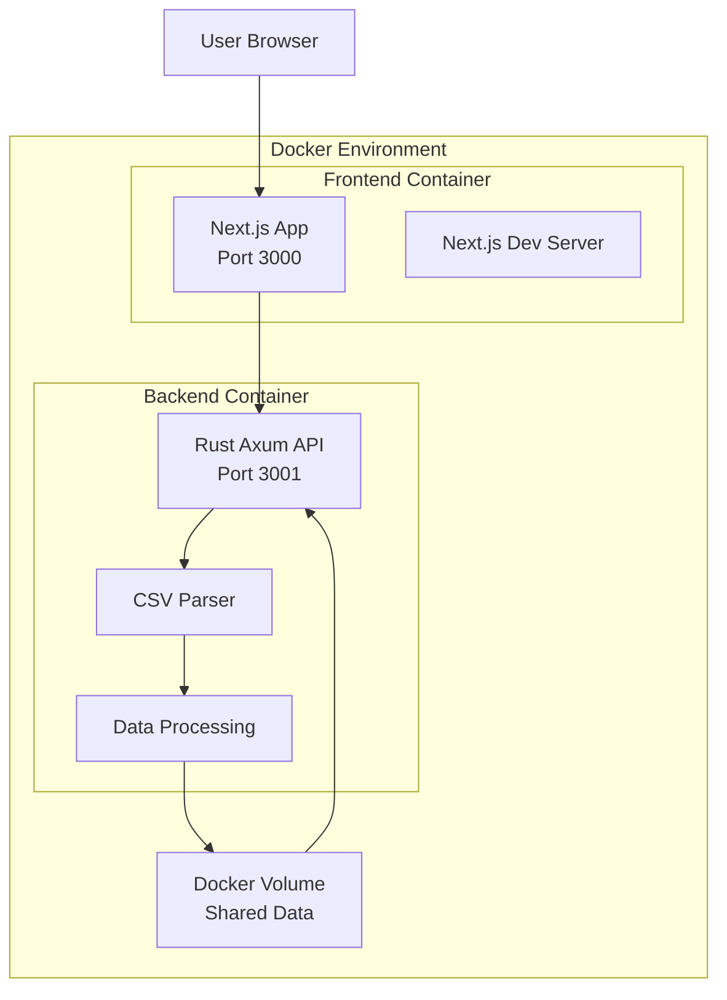

# Design Document

## Overview

Cursor Usage Dashboardは、CSVファイルからCursorのAPI使用データを読み込み、インタラクティブなダッシュボードで可視化するWebアプリケーションです。フロントエンドはReact + TypeScript、バックエンドはRust + Axumで構築し、全体をDockerで環境分離します。

## Architecture

### System Architecture



### Technology Stack

**Frontend:**
- Next.js 16 + TypeScript (App Router)
- React Server Components
- Recharts (data visualization)
- Tailwind CSS 4 (styling)
- Built-in fetch API (HTTP client)
- Bun (package manager and runtime)

**Backend:**
- Rust + Axum (web framework)
- Tokio (async runtime)
- csv crate (CSV processing)
- serde (serialization/deserialization)
- tower-http (CORS middleware)
- criterion (performance benchmarking)
- tokio-test (async testing utilities)

**Development Environment:**
- Docker + Docker Compose
- Volume mounting for hot reload
- Environment variables for configuration

## Components and Interfaces

### Frontend Components (Next.js App Router)

#### 1. Page Components
- **app/page.tsx**: Main dashboard page (Server Component)
- **app/layout.tsx**: Root layout with global styles and metadata

#### 2. Client Components

##### FileUpload Component (Client Component)
```typescript
'use client'
interface FileUploadProps {
  onFileUpload: (data: UsageData[]) => void;
  isLoading: boolean;
}
```

##### Dashboard Component (Client Component)
```typescript
'use client'
interface DashboardProps {
  data: UsageData[];
  dateRange: DateRange;
  onDateRangeChange: (range: DateRange) => void;
}
```

##### Visualization Components (Client Components)
- **TokenUsageChart**: Time-series line chart with daily/hourly granularity toggle
- **CostBreakdownChart**: Pie chart for cost by model with overall/individual model toggle
- **ModelStatsTable**: Table showing model usage statistics with filtering
- **SummaryCards**: Key metrics display with comprehensive statistics
- **TimeGranularitySelector**: Toggle between daily and hourly views
- **ModelViewToggle**: Switch between individual model and aggregated views

#### 3. API Routes
- **app/api/proxy/upload/route.ts**: Proxy to backend upload endpoint
- **app/api/proxy/stats/route.ts**: Proxy to backend stats endpoint

### Backend API Endpoints

#### POST /api/upload
```rust
// Upload and parse CSV file
Request: multipart/form-data with 'csvFile'
Response: {
  success: bool,
  data: Vec<UsageData>,
  summary: UsageSummary,
}
```

#### POST /api/upload/append
```rust
// Append new CSV data to existing dataset
Request: multipart/form-data with 'csvFile'
Response: {
  success: bool,
  data: Vec<UsageData>,
  summary: UsageSummary,
}
```

#### GET /api/stats/comprehensive
```rust
// Get comprehensive statistical insights
Response: {
  peak_usage: PeakUsageStats,
  cost_efficiency: CostEfficiencyStats,
  usage_trends: UsageTrendStats,
  cache_performance: CacheStats,
  model_comparison: Vec<ModelComparisonStats>,
}
```

#### GET /api/health
```rust
// Health check endpoint
Response: { status: "ok", timestamp: String }
```

## Data Models

### UsageData Struct
```rust
#[derive(Debug, Clone, Serialize, Deserialize)]
pub struct UsageData {
    pub date: String, // ISO 8601 format
    pub kind: String, // "Included" etc.
    pub model: String, // "auto" etc.
    pub max_mode: bool,
    pub input_with_cache: u32,
    pub input_without_cache: u32,
    pub cache_read: u32,
    pub output_tokens: u32,
    pub total_tokens: u32,
    pub cost: f64,
}
```

### UsageSummary Struct
```rust
#[derive(Debug, Serialize, Deserialize)]
pub struct UsageSummary {
    pub total_cost: f64,
    pub total_tokens: u32,
    pub average_cost_per_day: f64,
    pub most_used_model: String,
    pub date_range: DateRange,
    pub model_breakdown: Vec<ModelStats>,
}
```

### ModelStats Struct
```rust
#[derive(Debug, Serialize, Deserialize)]
pub struct ModelStats {
    pub model: String,
    pub total_requests: u32,
    pub total_tokens: u32,
    pub total_cost: f64,
    pub average_tokens_per_request: f64,
    pub cache_efficiency: f64, // percentage
}
```

### Comprehensive Statistics Structs
```rust
#[derive(Debug, Serialize, Deserialize)]
pub struct PeakUsageStats {
    pub peak_hour: u8,
    pub peak_day: String,
    pub peak_tokens_per_hour: u32,
    pub peak_cost_per_day: f64,
}

#[derive(Debug, Serialize, Deserialize)]
pub struct CostEfficiencyStats {
    pub cost_per_token: f64,
    pub cost_per_request: f64,
    pub cache_savings: f64,
}

#[derive(Debug, Serialize, Deserialize)]
pub struct UsageTrendStats {
    pub daily_growth_rate: f64,
    pub usage_pattern: String, // "increasing", "stable", "decreasing"
    pub usage_percentiles: UsagePercentiles,
}

#[derive(Debug, Serialize, Deserialize)]
pub struct UsagePercentiles {
    pub median: u32,
    pub p95: u32,
    pub p99: u32,
}
```

## Error Handling

### Frontend Error Handling
- Global error boundary for React components
- Toast notifications for user-facing errors
- Loading states during API calls
- File validation before upload

### Backend Error Handling
- Axum error handling middleware
- CSV parsing error handling with detailed messages
- File size and type validation
- Structured error responses using Result types

```rust
#[derive(Debug, Serialize)]
pub struct ErrorResponse {
    pub success: bool,
    pub error: ErrorDetails,
}

#[derive(Debug, Serialize)]
pub struct ErrorDetails {
    pub code: String,
    pub message: String,
    pub details: Option<serde_json::Value>,
}
```

### Common Error Scenarios
1. **Invalid CSV Format**: Missing required columns, incorrect data types
2. **File Size Exceeded**: Files larger than 10MB
3. **Network Errors**: API connection failures
4. **Parsing Errors**: Malformed CSV data

## Testing Strategy

### Frontend Testing
- Component unit tests with React Testing Library
- Integration tests for data flow
- Visual regression tests for charts
- E2E tests with Playwright

### Backend Testing
- API endpoint tests with Rust's built-in test framework
- CSV parsing unit tests using tokio-test
- File upload integration tests with axum-test
- Error handling tests with comprehensive error scenarios
- Performance benchmarks using criterion crate
- Load testing with concurrent request scenarios
- Memory usage profiling for large dataset processing

### Docker Testing
- Container build verification
- Service connectivity tests
- Volume mounting validation
- Environment variable configuration tests

## Development Workflow

### Local Development Setup
1. Clone repository
2. Run `docker compose up --build`
3. Frontend available at http://localhost:3000
4. Backend API at http://localhost:3001
5. Hot reload enabled for both services

### Running Commands in Docker
All development commands should be executed inside Docker containers:
- Frontend commands: `docker compose exec view <command>`
- Backend commands: `docker compose exec api <command>`

Examples:
- Install frontend dependencies: `docker compose exec view bun install`
- Run frontend dev server: `docker compose exec view bun run dev`
- Build frontend: `docker compose exec view bun run build`
- Run backend tests: `docker compose exec api cargo test`
- Run backend benchmarks: `docker compose exec api cargo bench`

### File Structure
```
cursor-usage-dashboard/
├── docker-compose.yml
├── frontend/
│   ├── Dockerfile
│   ├── package.json
│   ├── next.config.js
│   ├── tsconfig.json
│   └── app/
│       ├── layout.tsx
│       ├── page.tsx
│       ├── api/
│       │   └── proxy/
│       ├── components/
│       └── types/
├── backend/
│   ├── Dockerfile
│   ├── Cargo.toml
│   └── src/
│       ├── handlers/
│       ├── models/
│       ├── services/
│       └── utils/
└── shared/
    └── types/
```

## Security Considerations

- File upload size limits (10MB max)
- CSV content validation and sanitization
- CORS configuration for development
- No persistent data storage (memory only)
- Input validation for all API endpoints