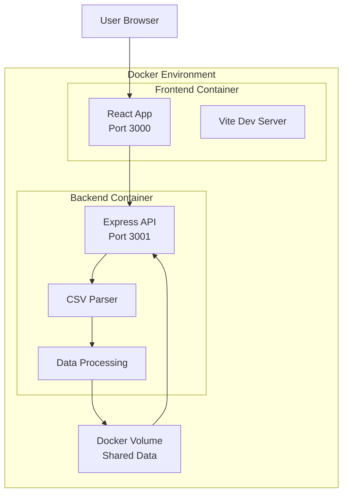

# Design Document

## Overview

Cursor Usage Dashboardは、CSVファイルからCursorのAPI使用データを読み込み、インタラクティブなダッシュボードで可視化するWebアプリケーションです。フロントエンドはReact + TypeScript、バックエンドはNode.js + Expressで構築し、全体をDockerで環境分離します。

## Architecture

### System Architecture



### Technology Stack

**Frontend:**
- React 18 + TypeScript
- Vite (development server with HMR)
- Recharts (data visualization)
- Tailwind CSS (styling)
- Axios (HTTP client)

**Backend:**
- Node.js + Express
- Multer (file upload handling)
- csv-parser (CSV processing)
- CORS middleware

**Development Environment:**
- Docker + Docker Compose
- Volume mounting for hot reload
- Environment variables for configuration

## Components and Interfaces

### Frontend Components

#### 1. App Component
- Main application container
- Manages global state and routing
- Handles file upload coordination

#### 2. FileUpload Component
```typescript
interface FileUploadProps {
  onFileUpload: (data: UsageData[]) => void;
  isLoading: boolean;
}
```

#### 3. Dashboard Component
```typescript
interface DashboardProps {
  data: UsageData[];
  dateRange: DateRange;
  onDateRangeChange: (range: DateRange) => void;
}
```

#### 4. Visualization Components
- **TokenUsageChart**: Time-series line chart for token usage
- **CostBreakdownChart**: Pie chart for cost by model
- **ModelStatsTable**: Table showing model usage statistics
- **SummaryCards**: Key metrics display

### Backend API Endpoints

#### POST /api/upload
```typescript
// Upload and parse CSV file
Request: FormData with 'csvFile'
Response: {
  success: boolean;
  data: UsageData[];
  summary: UsageSummary;
}
```

#### GET /api/health
```typescript
// Health check endpoint
Response: { status: 'ok', timestamp: string }
```

## Data Models

### UsageData Interface
```typescript
interface UsageData {
  date: string; // ISO 8601 format
  kind: string; // "Included" etc.
  model: string; // "auto" etc.
  maxMode: boolean;
  inputWithCache: number;
  inputWithoutCache: number;
  cacheRead: number;
  outputTokens: number;
  totalTokens: number;
  cost: number;
}
```

### UsageSummary Interface
```typescript
interface UsageSummary {
  totalCost: number;
  totalTokens: number;
  averageCostPerDay: number;
  mostUsedModel: string;
  dateRange: {
    start: string;
    end: string;
  };
  modelBreakdown: ModelStats[];
}
```

### ModelStats Interface
```typescript
interface ModelStats {
  model: string;
  totalRequests: number;
  totalTokens: number;
  totalCost: number;
  averageTokensPerRequest: number;
  cacheEfficiency: number; // percentage
}
```

## Error Handling

### Frontend Error Handling
- Global error boundary for React components
- Toast notifications for user-facing errors
- Loading states during API calls
- File validation before upload

### Backend Error Handling
- Express error middleware
- CSV parsing error handling
- File size and type validation
- Structured error responses

```typescript
interface ErrorResponse {
  success: false;
  error: {
    code: string;
    message: string;
    details?: any;
  };
}
```

### Common Error Scenarios
1. **Invalid CSV Format**: Missing required columns, incorrect data types
2. **File Size Exceeded**: Files larger than 10MB
3. **Network Errors**: API connection failures
4. **Parsing Errors**: Malformed CSV data

## Testing Strategy

### Frontend Testing
- Component unit tests with React Testing Library
- Integration tests for data flow
- Visual regression tests for charts
- E2E tests with Playwright

### Backend Testing
- API endpoint tests with Jest + Supertest
- CSV parsing unit tests
- File upload integration tests
- Error handling tests

### Docker Testing
- Container build verification
- Service connectivity tests
- Volume mounting validation
- Environment variable configuration tests

## Development Workflow

### Local Development Setup
1. Clone repository
2. Run `docker-compose up --build`
3. Frontend available at http://localhost:3000
4. Backend API at http://localhost:3001
5. Hot reload enabled for both services

### File Structure
```
cursor-usage-dashboard/
├── docker-compose.yml
├── frontend/
│   ├── Dockerfile
│   ├── package.json
│   ├── vite.config.ts
│   └── src/
│       ├── components/
│       ├── types/
│       └── utils/
├── backend/
│   ├── Dockerfile
│   ├── package.json
│   └── src/
│       ├── routes/
│       ├── middleware/
│       └── utils/
└── shared/
    └── types/
```

## Security Considerations

- File upload size limits (10MB max)
- CSV content validation and sanitization
- CORS configuration for development
- No persistent data storage (memory only)
- Input validation for all API endpoints